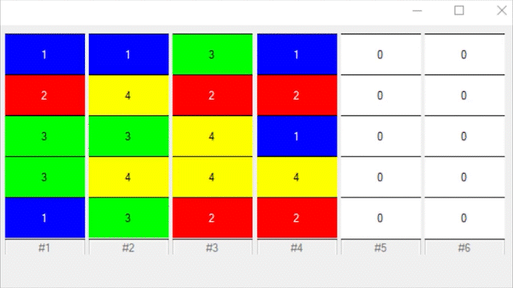

# Water Sorter Puzzle Solver - C# Project
## Introduction
#### Author: Steve Tamayo
This project was made in Visual Studio from August 2022 - September 2022. The application finds the solution to a water sorter puzzle in the least number of steps using heuristic programming. The application can also create random tubes based on three common factors found in water puzzles: number of different colors, number of empty tubes, and how many segments of water can fit in a tube (the application refers to a segment as "section"). Finally, the application allows the user to customize the water puzzle to any legal configuration.

**Quick Note: The application has certain limits in place for the solver based on what I discovered through testing:**
* You can have a minimum of 2 colors to a maximum of 15 colors.
* You can have a minimum of 2 empty tubes and a maximum of 4 empty tubes
* You can have a minimum of 3 sections and a maximum of 5 sections
* If the solver tries to come up with a solution and fails, if the minimum number of empty tubes is below 4, it will ask if the user would like to add an empty tube and rerun the solver.
* Each section has a number inside for accessibility

## What is a Water Sorter Puzzle?

There are many different versions of this idea out there, but the basics are that you have multiple containers (in this application refered to as "tubes") with sections of water that have been mixed up. You can move the top most color of a tube to an empty tube or another tube with an open section, as long as the color you are moving matches the top most color in the receving tube. *In this application, two or more touching colors move as a singular unit with one step. You cannot split up touching colors after joining them.* You repeat this process until all colors are each matched in a singular tube.

An example of movement in a Water Sorter Puzzle (using this application UI):  

# Using the App (Main Window part 1)

When opening the app, you will see the main main window. I will focus on the right section for now. 

The top of this section displays the puzzle configuration (further refered to as "puzzle display"). In the bottom right is the "Check For Solution" button, which will have the application determine the solution for the puzzle in the least amount of steps. 

<!-- Insert GIF of mouse circling the top section (no solution shown), then the Check for Solution section, click the Check for Solution button-->

When a solution is found, the section under the "puzzle display" will fill with text saying how many steps the solution takes. Under that will be a collection of buttons that show each step of the solution. "Start" shows the initial puzzle configuration. Each following button will have text in a "X->Y" format, with "X" being the tube the top color is being taken from and "Y" being the tube receiving that color. Clicking each button will show that step of the solution with the last being the tubes solved.

<!-- Insert GIF of mouse circling the solution text, then the steps button container, then clicking every step until the solution -->

At the bottom left of this right section are two other buttons: "Random Tubes" and "Edit Tubes". "Random Tubes" will randomize the puzzle configuration in the "puzzle display" based on three editable factors above it (number of colors, number of exmpty tubes, number of sections). You can then hit the "Check For Solution" button as normal to find the solution to this randomized configuration.

<!-- Insert GIF of mouse clicking the Random Tubes button, then circling the editable factors about it, then clicking the Rnadom tubes button, then finally the check for solutions button -->

Finally the "Edit Tubes" button wil open a new window called "Input Tubes." Here you can customize the puzzle configuration. I go over this window in the next section.

<!-- Insert GIF of mouse hitting "Edit Tubes" and opening the Input Tubes window -->

# Using the App (Input Tubes Window)

Basics of Window (Default)
Clearing Puzzle Configuration
Randomizing Tubes 
Adjusting puzzle's three factors
Changing the colors used
Using "Cursor Color Drop Mode"

## Basics of Window (Default)

After clicking the "Edit Tubes" button on the main window, you will land on the "Input Tubes" window. 

The main section appars in the middle of the left side of this window. Similar to the "puzzle display" this section shows the last puzzle configuration from the main window. Unlike the main window, the user can click each section of each tube. The result of this click changes depending on which mode the user is currently in. By default, clicking a section will turn that section white with the text "Edit" to indicate that section is being focused on. It will also open a small display with each color and white representing an empty section. Clicking one of these will change that section into the color or an empty section. 

<!-- Insert GIF selecting  a top section and changing it to a few different colors.--> 

**Note, if you change a section into an empty section and there are color sections above it in the tube, the section's 0 will be bolded and a warning on the right side will be displayed as "Air Pocket Found" with the offending air pocket's location displayed for the user.**

<!-- Insert GIF selecting a middle section and changing it to a few different colors, but then show an air pocket, cicle the Air Pocket Found with mouse, then fix it manually--> 

You might notice that a button that was previously disabled is now clickable. If you have any air pockets, you can hit the "Gravity Falls" button which will cause all color sections above air pockets to be pushed down to fill out the tube. Empty sections can exist at the top of the tube, but not below color sections.

<!-- Insert GIF creating many air pockets, then hitting the Gravity Falls button. -->

An additional feature in the section that warned about "Air Pockets" is a section that shows each color currently being used for the puzzle (as well as number for accessibility). To the right of each one will display how many sections of that color are in the puzzle configuration out of how many sections should be in the puzzle. The font will display red and have an exclaimation point next to it until the issue has been corrected.

<!-- Insert GIF showing all the issues with Available Colors created by the Gravity Falls button being hit, overcorrect to add too many of one color, then fix any issues -->

These issues display for the user's sake. Additionally, the "Verify" button will check to see if the current puzzle configuration is solveable. If it is, a pop-up window will appear titled "Combination Verified!" and the message "Cancel to continue modifying tubes." Clicking "OK" will close the "Input Tubes" and place the puzzle configuration the user created into the main windows "puzzle display" while the "Cancel" button will let the user continue modifying the configuration.

<!-- Insert GIF clicking the Verify button, then OK, then returning to the main menu, then clicking edit tubes, verify, and cancel -->

The "Cancel" button will close the window just like the "X" button in the top right of the window. Either one of these will not transfer the current input configuration to the main window (but color configurations will remain, explained in this section //todo insert link).

<!-- Insert GIF making rnadom changes, then hitting the cancel button to return to the main window, then hit edit tube to show non of the changes remain-->

## Clearing Puzzle Configuration

If you want to start with a blank tube list, you can click the "Clear All Tubes" button. A confirmation pop-up window will ask if you are sure, giving you the option to back out.

<!-- Insert GIF clicking Clear All Tubes, canceling, then CLicking it again and hitting "OK -->

## Randomizing Tubes

You can also randomize the tubes based on the current puzzle's three factors (number of colors, number of exmpty tubes, number of sections). This will randomize the puzzle using the left most tubes. 

<!-- Insert GIF clicking Random Tubes -->

**Note that adjusting the three factors here works differently than the main window and will be covered in the next section.**

## Adjusting puzzle's three factors

In the top left section of the "Input Tubes" section are the three factors that adjust the base of a water puzzle's configuration. In this window, adjusting each one will automatically change the input tube's configuration, affecting the current configuration.

###Number of Colors:

Increasing the number of colors will add another tube to the configuration. It will add it to the right of the last tube with color in it. By default it will add an empty tube. There is a check box below the display "Add Colors To Tubes Right Away" which if check will add a filled tube. You can then randomize the tubes to shuffle the colors.

<!-- Insert GIF increasing the number of colors by 1 with checkbox off, then decrease number of colors by 1, check the box, then increase the number by 1, then 1 more, then randomize -->

**If there is an empty tube between tubes with color, the color one will shift over.**

<!-- Insert GIF putting a color in the right most tube (8), then increase the number of colors by 1-->

Decreasing the number of colors will remove a tube from the configuration, as well as removing all of that color from tubes. If the tubes are mixed, this can create many air pockets. (Reminder that you can hit the Random Tubes or even Gravity Falls button to fix this issue).

<!-- Insert GIF decreating the colors to 4, then Hit Gravity Falls, Followed by random Tubes-->

You can also insert a number into the field. The field will adjust if the number is lower than 2 or higher than 15 as per creator-based limitations.

<!-- Insert GIF changing the number to 0, then 60, then 4, and finally Random Tubes-->

### Number of Empty Tubes

Increasing the number of empty tubes will add another tube to the end of the configuration. Decreasing the number will remove the right most tube, regardless if it is empty or not.

<!-- Insert GIF increasing number of empty tubes by one, then decreasing by 1,, then increasing it by 1, then putting a few colors in the right most tube, then decreaing it by 1-->

You can also insert a number into the field. The field will adjust if the number is lower than 2 or higher than 4 as per creator-based limitations.

<!-- Insert GIF changing the empty tube to 10, then 0, which will default to 2, and finally Random Tubes-->

### Number of Sections

Increasing the number of sections will add another section to the top of every tube. This new section will always be empty. Decreasing the number will remove the bottom of every tube.

<!-- Insert GIF decreasing the number of sections by 1, then increasing it back to 5. -->

You can also insert a number into the field. The field will adjust if the number is lower than 3 or higher than 5 as per creator-based limitations.

<!-- Insert GIF changing the  number of sections to 0, then 30, which will default to 5, and finally Random Tubes-->

## Changing the colors used

You can change the colors used for each number by clicking the box of the color underneath "Available Colors", which opens a color selector. Note that changing the color here changes it in the whole application regardless if you Verify the configuration.

<!-- Insert GIF of changing color number 4 to black, canceling out of the Input Tubes and showing the old puzle's color has changed.-->

You can change this back by Hitting the "Restore Default Colors" in the Main Window.

<!-- Insert GIF of clicking that restore default colors button-->

## Using "Cursor Color Drop Mode"

In the bottom right of the "Input Tubes" window is the "Cursor Color Drop Mode" button. When you click it, a white box with "O" within will appear next to it. This signifys that this mode is turned active. 

In this mode, clicking tube sections will no longer display all color options, but turn that section into whichever color is displayed in the box next to the mode button. In order to change the color selected, click one of the boxes under the "Available Colors". The color display at the bottom will change to match the chosen color. In addition, right clicking on a tube section will turn it into an empty section.

<!-- Insert GIF clicking the cursor color mode. Then click color 1 and change some sections. THen right click a few sections.-->

You can still right click the available colors to change the color. 

<!-- Insert GIF of changing color number 4 to black, canceling out of the Input Tubes and showing the old puzle's color has changed.-->

# Additional features

##Save Config and Load

Everytime you close the application, the current puzzle configuration will be saved. You can also manually save a configuration by clicking the "Save Config" save. This configuration can be loaded in with the "Load" button. Until you leave the app, you can return to that load.

<!-- Insert GIF of Saving a Config, hitting and messing with Random Tubes and features, then Load-->

##Color Blind Mode

In the top left corner is a "Color Blind Mode checkbox". This will change the default colors to a palette for people with deuteranopia or protanopia. The colors were found from this blog post: https://jacksonlab.agronomy.wisc.edu/2016/05/23/15-level-colorblind-friendly-palette/ As a note, most of the colors for the default color palette were also chosen from this palette.

<!-- Insert GIF Toggling the color blind mode off and on-->

<!-- Insert IMAGE color pallet -->

